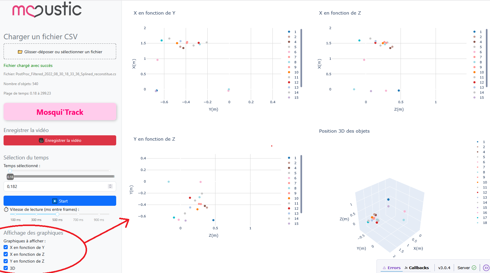

# Welcome to Mosqui'Track documentation! Tests last

## 1- Graphes en 2D et 3D 

## 2- Graphes des axes de trajectoires en fonction du temps 

## 3- Graphes illustrant la distance entre deux trajectoires

## 4- Selection du temps

## 5- Enregistrer une vidéo

### A- Paramètres 

### B- Localisation de la vidéo 

## Contact

For questions or suggestions, please contact:
olivier.roux@ird.fr

Project developed as part of a Master's thesis on mosquito behavior analysis.

